  

> 🌐 **中文版**: [README.md](./README.md)

---

## Hi, I'm Huasan 👋

🌱 **AI Coding Practitioner**  ·  🛠️ **Indie Developer**  ·  📝 **Build in Public**

Former education ops team lead, turned full-time AI Coding indie developer. Learning by doing, **shipping the process as content**.

Currently exploring two directions:

- 🧩 **AI + OPC (One Person Company)** — Turning indie-dev workflows into reusable Claude Code Skills, exploring the smallest viable business loop for a one-person AI-native company.
- 👧 **AI + Education** — Exploring a new K12 paradigm for the AI era: helping young learners experience *"I can create things"*. Plus mentoring others transitioning into the AI + OPC path.

  
  
  

> 💭 Not teaching you to code. Showing you how to collaborate with AI to ship ideas.

---

## 🧰 Stack & Tools

  
  
  
  
  
  
  

  
  
  
  

---

## 🌟 What I'm Working On

<table>
  <tr>
    <td width="50%" valign="top">
      <h3>🧩 AI + OPC Exploration</h3>
      <ul>
        <li>Turning indie-developer workflows into reusable Claude Code Skills</li>
        <li>Searching for the smallest viable business loop for a one-person AI-native company</li>
        <li>Build → ship skill → write about it → repeat</li>
      </ul>
    </td>
    <td width="50%" valign="top">
      <h3>👧 AI + Education Pilot</h3>
      <ul>
        <li>K12 pilot — helping a 12-year-old experience the self-belief <em>"I can create things"</em> with AI</li>
        <li>Sharing the process for others transitioning into AI + OPC</li>
        <li>Recording everything as content, Salman Khan style</li>
      </ul>
    </td>
  </tr>
</table>

---

## 🛠️ Open Source

Sorted by recent activity. No "flagship" project yet — taking it slow, shipping consistently.

[Browse repositories →](https://github.com/huasanai?tab=repositories)

---

## 📈 GitHub Activity

  

  
  
  

> Auto-refreshed daily via GitHub Actions.

---

## 💭 Philosophy

> There's no perfect "think it through first" moment.
> Validate with the smallest experiment, iterate fast — that's the biggest advantage ordinary people have in the AI era.

---

## 💬 Reach out

If you're shipping in public, exploring one-person AI companies, or working on AI + education — hit me up on [X @yfusionai](https://x.com/yfusionai).

---

  Made with ❤️ in Build in Public mode.

